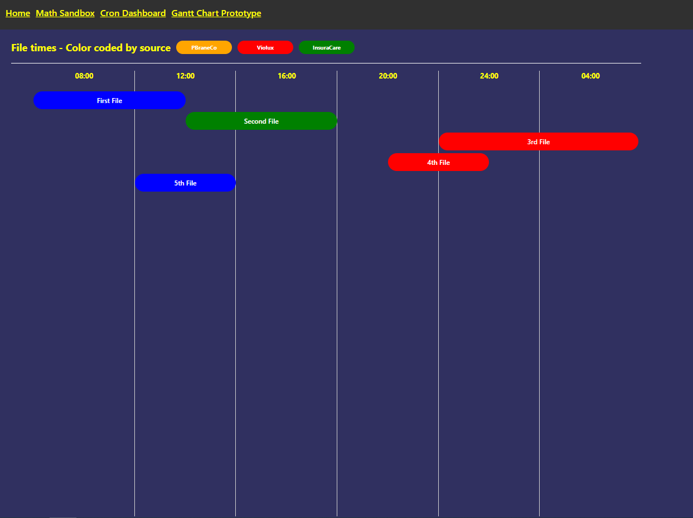
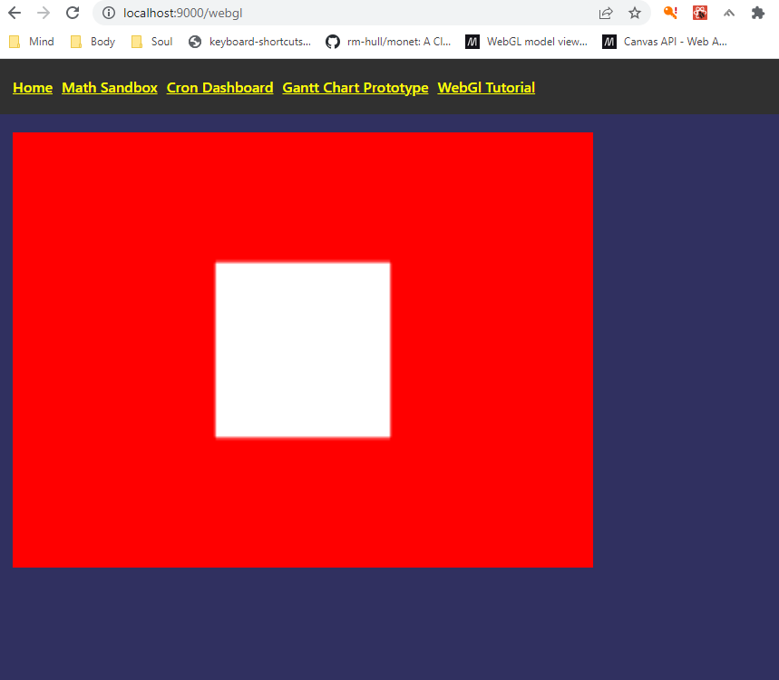
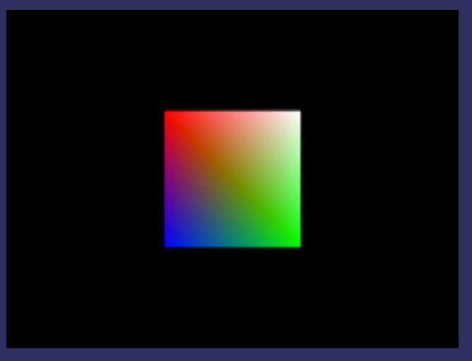
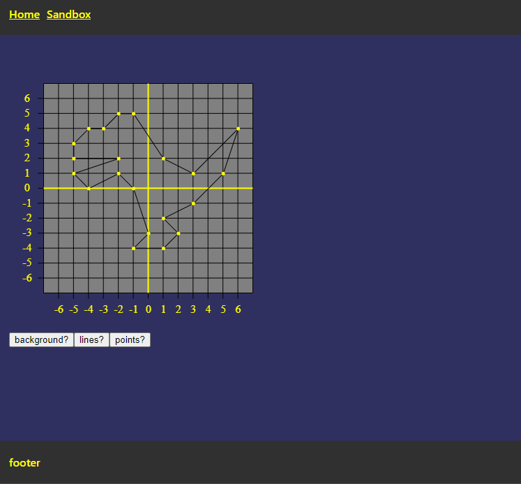
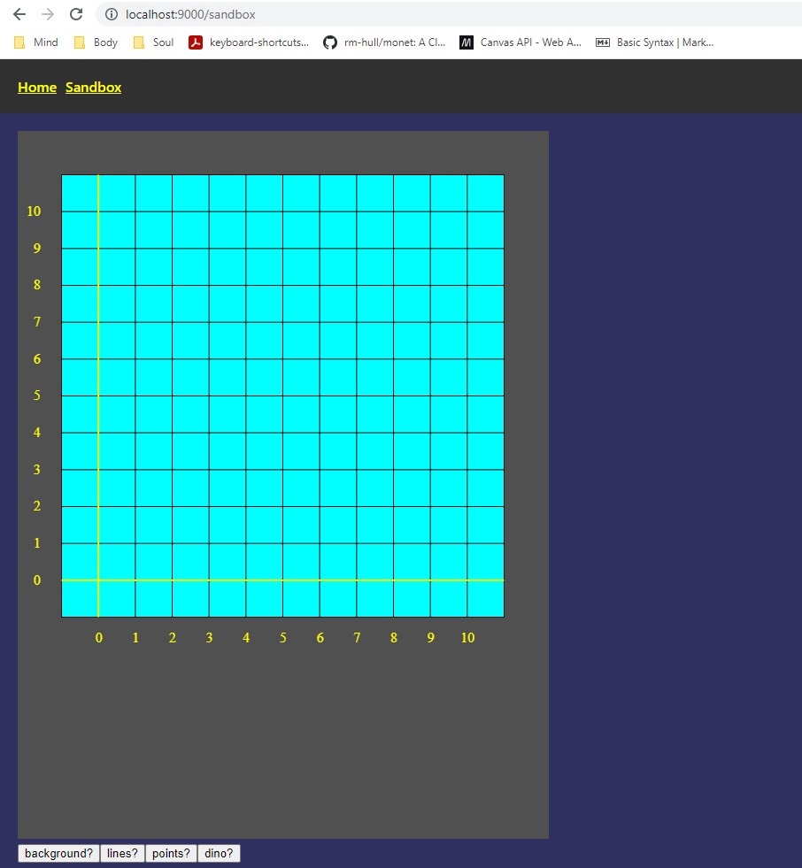

#Overview

Development sandbox for multiple projects

# Dynamic gantt chart

# WebGl

[WebGl](https://developer.mozilla.org/en-US/docs/Web/API/WebGL_API)

Working through the WebGl 3D graphics tutorial

# Math for Programmers Sandbox

Working through chapters and excecises in [Math for Programmers](https://www.manning.com/books/math-for-programmers?utm_source=google&utm_medium=cpc&utm_campaign=dynamicremarketing&gclid=EAIaIQobChMI_Lb1466v6AIVkkZeCh1HuwuNEAEYASACEgLgkvD_BwE)

The programs in this book are in Python and I using it to learn how mostly practice with Clojure(Script), Clojure Helix, HTML Graphic(Canvas & SVG) and also learn some more Math :)

---

# Chapter 2

More dynamic chart allows for differenct domains and ranges.

NOTES:
Sometime drawing to a canvas locks up a brower from the drawing loop.  Powershell commands
1. netstat -ano | findstr <PORT>
2. taskkill /PID <PID> /f

